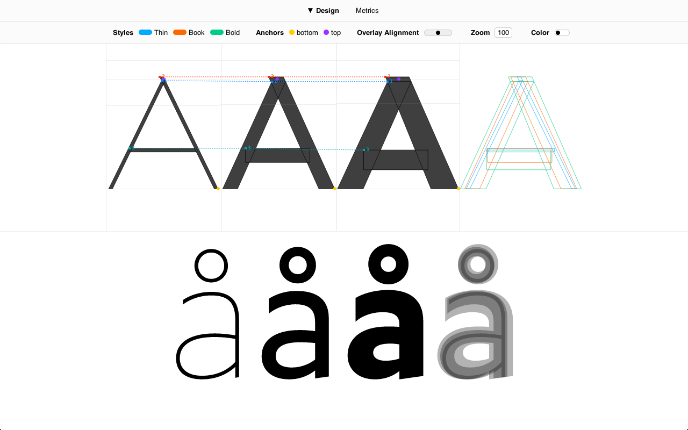
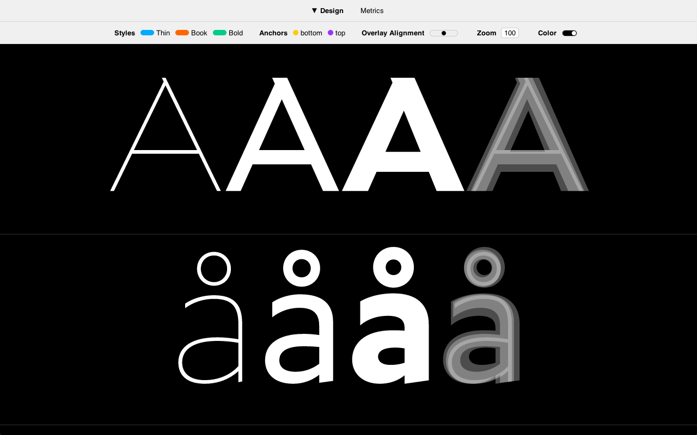
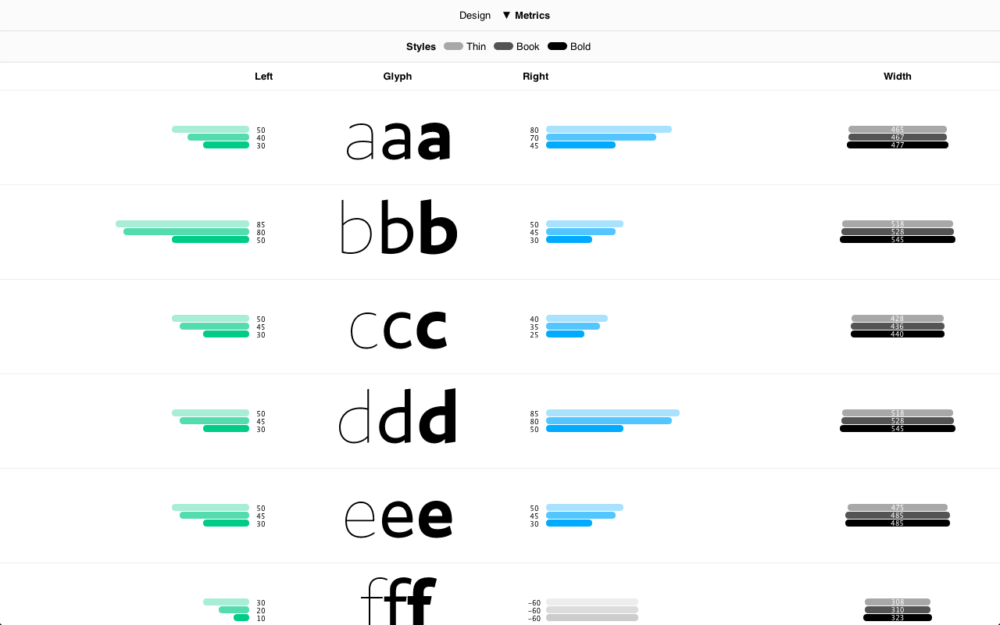

# Font Inspector

Font Inspector is an analytics script for FontLab and RoboFont. 
It generates a comprehensive overview of design and metrics of all open fonts into a single HTML file.

[View Example](http://www.urtd.net/x/fontinspector/FontInspector.html)

## How does it work?

1. Install: Download [FontInspector.py](fontinspector.py) script and place it to your application script folder.
- Select Fonts and Glyphs: Open all fonts you wish to inspect and select few glyphs in one of them.
- Run: Run the script and it will generate a HTML file in the current font's folder.
- Inspect: Open the HTML in your browser, preferably Google Chrome.

## Keyboard

- `←→`: Overlay Alignment
- `↑↓`: Zoom
- `Space`: Toggle Color
- `Esc`: Reset All Settings

### Some outlines don't show their startpoints, why?

Outlines without startpoints are components.

### Why are some overlays red?

The outlines are incompatible. 
However, some incompatible glyphs might still show up as compatible. 
This is because sometimes it is not possible to determine compatibility just with math. 
See next answer for a solution.

### How can I fix incompatible outlines?

The single best option is to use [Prepolator](http://tools.typesupply.com/prepolator.html). 
If you are a FontLab user and want to try it, you need to [export your fonts to UFO format](http://www.robofab.org/howto/makeufo.html) first.

### Why are some bars red?

In range of styles from light to bold, sidebearings usually shrink and widths grow. 
If this expected progression isn't found, the bars are highlighted with red color. 
However, it doesn't necessarily signal an error, there are many exception to the rule.

### Why are some bars grey?

Grey color represents negative sidebearings.

## Disclaimer

Font Inspector was made by [Ondrej Jób](http://www.urtd.net), who runs his type foundry [Urtd](http://www.urtd.net) from Bratislava, Slovakia.

Font Inspector is distributed under the [GNU General Public License 3.0](https://gnu.org/licenses/gpl.html). 
For any application that may be incompatible with this license, please contact me to discuss alternatives.

Font Inspector is distributed in the hope that it will be useful, but WITHOUT ANY WARRANTY; 
without even the implied warranty of MERCHANTABILITY or FITNESS FOR A PARTICULAR PURPOSE.

jQuery is released under the terms of the [MIT license](http://en.wikipedia.org/wiki/MIT_License).